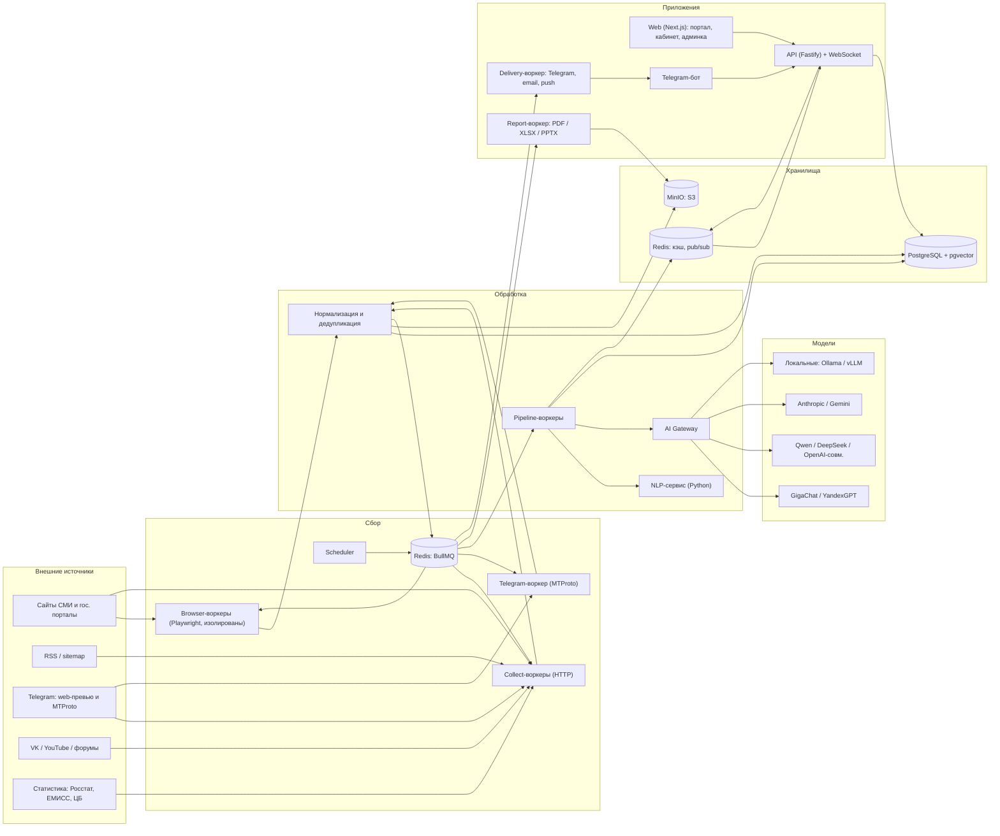

# МедиаРадар — архитектура

> Часть комплекта документов: [PLAN](PLAN.md) · **ARCHITECTURE** · [PRODUCT_SPEC](PRODUCT_SPEC.md) · [DATA_MODEL](DATA_MODEL.md)

---

## 1. Контекст и принципы

**Форма системы — модульный монолит + воркеры + один изолированный NLP-сервис.** Не микросервисы: для команды из одного-двух человек и нагрузки в сотни пользователей это лишняя сложность. Модули (`packages/*`) разделены жёсткими границами и могут быть вынесены в отдельные процессы без переписывания.

Ключевые архитектурные идеи:

1. **Два слоя данных.** *Общий слой контента* (источники, материалы, обогащение — собираются и обрабатываются один раз) и *слой тенанта* (какие источники видит клиент, его рубрики, алерты, отчёты, роли, тариф). Экономит сбор и NLP; делает «каталог источников» ценным активом платформы.
2. **Конвейер из идемпотентных стадий.** Каждая стадия — отдельная очередь/задача с версией и записью результата; можно перезапустить для одного материала, источника или всего корпуса.
3. **Всё конфигурируемое — через реестр настроек** (платформа → тенант → источник → пользователь), с валидацией, историей и аудитом.
4. **Границы доверия.** Всё, что приходит из интернета (HTML, тексты, Telegram-сообщения), — недоверенные данные: очищаем, ограничиваем, не исполняем, не передаём в LLM как инструкции.
5. **Заменяемость внешнего.** Провайдеры AI, платежей, поиска, хранилища, доставки уведомлений — за интерфейсами с адаптерами.

---

## 2. Общая схема



---

## 3. Компоненты

| Компонент | Ответственность | Масштабирование |
|-----------|-----------------|-----------------|
| **web** (Next.js) | Публичный портал (SSR/SEO), кабинет клиента, супер-админка | Горизонтально, stateless |
| **api** (Fastify) | REST `/v1`, аутентификация/авторизация, WebSocket-шлюз, вебхуки (ЮKassa и др.) | Горизонтально; WS-фан-аут через Redis |
| **scheduler** (singleton) | Превращает расписания источников в задачи; адаптивная частота; ретро-сбор; плановые отчёты и дайджесты | Один активный экземпляр (выбор лидера через Redis-lock) |
| **worker-collect** | HTTP-коннекторы: RSS, sitemap, статический HTML, VK, YouTube, Telegram web-preview, показатели | По числу ядер/хостов; лимиты на домен |
| **worker-browser** | Playwright-пул для JS-сайтов. **Отдельный контейнер без доступа к внутренней сети** | Ограничение числа браузеров (≈3–4 одновременно на 8 vCPU) |
| **worker-telegram** | MTProto-сессии (GramJS): чаты, каналы, история | По числу служебных аккаунтов |
| **worker-process** | Стадии конвейера обработки, оркестрация вызовов NLP и AI Gateway | По очередям стадий |
| **nlp** (Python, FastAPI) | NER, тональность, эмбеддинги, ключевые слова, лемматизация. HTTP-контракт, версионируемые модели | Реплики; опционально GPU |
| **worker-report** | Рендер отчётов: HTML → PDF (Playwright), XLSX (exceljs), PPTX (pptxgenjs) | По очереди |
| **worker-deliver** | Доставка: Telegram, email, web-push; ретраи, подавление дублей | По очереди |
| **bot** | Telegram-бот (поиск, подписки, сводки) | Webhook/long-poll |
| **PostgreSQL** | Основная БД | Вертикально → реплика для чтения → при необходимости выделение аналитики |
| **Redis** | Очереди BullMQ, кэш, pub/sub для реалтайма, rate-limit | Один экземпляр с AOF |
| **MinIO (S3)** | Сырой HTML, изображения, отчёты, бэкапы | Один узел → distributed |
| **Caddy** | Reverse-proxy, автоматический TLS | — |

---

## 4. Технологический стек

> Точные версии фиксируются lockfile'ом в начале Фазы 0 (актуальные LTS на тот момент).

| Слой | Выбор | Почему / когда пересмотреть |
|------|-------|------------------------------|
| Язык | TypeScript (strict) + Python (только `services/nlp`) | Один язык для всего, кроме русского NLP |
| Монорепо | pnpm workspaces + Turborepo | Кэш сборок, единые зависимости |
| API | Fastify + Zod-схемы → OpenAPI | Скорость, типобезопасность, автогенерация документации и SDK |
| ORM/миграции | Drizzle ORM + SQL-миграции (RLS, партиции — руками в SQL) | Близость к SQL, прозрачность, нужная нам тонкая работа с RLS |
| Очереди | BullMQ (Redis) | Приоритеты, ретраи, repeatable-задачи/планировщики, Bull Board |
| Web | Next.js (App Router), React, Tailwind, Radix/shadcn-компоненты | SSR для SEO, единая кодовая база портала/кабинета/админки |
| Графики | Apache ECharts (+ обёртка в `packages/ui`) | Карты-хороплеты, тепловые карты, графы, облако слов |
| Браузер для сбора | Playwright (Chromium) | JS-рендеринг, скриншоты для студии парсеров |
| HTML-извлечение | undici + cheerio/linkedom + Mozilla Readability | Быстро и дёшево; браузер — только как запасной вариант |
| БД | PostgreSQL (актуальная стабильная) + `pgvector` + `pg_trgm` | RLS, JSONB, партиции, FTS (`russian`), векторный поиск |
| Поиск | Старт: Postgres FTS; интерфейс `SearchProvider` | См. §16: OpenSearch/Meilisearch подключаем по бенчмарку |
| Аналитика | Агрегатные таблицы в Postgres; интерфейс `AnalyticsStore` | См. §16: ClickHouse при росте |
| Реалтайм | WebSocket (`@fastify/websocket`) + Redis pub/sub, SSE как запасной вариант | — |
| Аутентификация | Свои сессии (httpOnly cookie, argon2id), TOTP 2FA; OAuth «Яндекс ID / VK ID» — Фаза 7+; OIDC/SAML — Enterprise | Минимум внешних зависимостей |
| Хранилище объектов | MinIO (S3 API) | Свой хостинг; код не привязан — любой S3 |
| NLP | Natasha/Slovnet, русские BERT-модели, мультиязычные эмбеддинги (ONNX/CPU); см. оговорку о лицензиях | Список — кандидаты; **финальный выбор по замеру качества и лицензии** |
| Отчёты | Playwright (PDF), exceljs, pptxgenjs | Чистая вёрстка в HTML → PDF, без отдельного движка |
| Наблюдаемость | Pino (логи), OpenTelemetry, Prometheus + Grafana + Loki, GlitchTip (Sentry-совместимый), Uptime Kuma | Всё self-hosted, без отправки данных наружу |
| Прокси/TLS | Caddy | Автоматические сертификаты, простая конфигурация |
| Контейнеры | Docker + Compose | Одна команда на развёртывание |
| CI/CD | GitHub Actions: lint, typecheck, тесты, сборка и публикация образов | — |
| Тесты | Vitest, Testcontainers, Playwright E2E, k6 | См. PLAN §6 |

---

## 5. Слои данных и мультитенантность

### 5.1 Что общее, что — тенанта

| Слой | Сущности | Видимость |
|------|----------|-----------|
| **Общий контент** | `sources`, `source_configs`, `articles`, `article_texts`, обогащение (NER, тональность, саммари, эмбеддинги), `entities` (канонические), `story_clusters`, `indicator_series` | Тенант видит материал, если подписан на источник (`tenant_sources`) |
| **Приватный контент** | Источники, добавленные тенантом как приватные (`sources.owner_tenant_id`), и их материалы (`articles.visibility_tenant_id`) | Только владелец-тенант |
| **Слой тенанта** | `tenants`, `memberships`, роли/права, `tenant_sources`, таксономия и метки (`tenant_article_labels`), сохранённые фильтры, алерты, отчёты, дашборды, подписка/биллинг, настройки, API-ключи | Строго по `tenant_id` |

### 5.2 Изоляция

- **PostgreSQL Row-Level Security** на всех таблицах слоя тенанта: политика `tenant_id = current_setting('app.tenant_id')::uuid`. API в каждой транзакции делает `SET LOCAL app.tenant_id = …`.
- Три роли БД: `app_api` (под RLS), `app_worker` (доступ к общему слою + явные операции над слоем тенанта), `app_admin` (миграции). Без `BYPASSRLS` в прикладных ролях.
- **Автотест на каждую таблицу**: «создать данные в тенанте A → прочитать/изменить/удалить из тенанта B → ожидаем 0 строк/отказ». Новая таблица без политики RLS не проходит CI (проверка по `pg_catalog`).
- Видимость общего слоя — через `tenant_sources`; при росте — материализованная таблица видимости (точка пересмотра, §16).

### 5.3 Режим «полная изоляция» (Enterprise)

Тенант получает отдельную **ячейку (cell)** — собственный экземпляр стека (§13). Нужен для on-premise/приватного контура и для других юрисдикций.

---

## 6. Конвейер сбора

### 6.1 Контракт коннектора

```
interface Connector {
  discover(ctx): AsyncIterable<ItemRef>         // что появилось нового (ссылки/ID/курсор)
  fetch(ctx, ref): RawDocument                  // получить сырой документ
  parse(ctx, raw): ArticleDraft | Skip          // нормализованный черновик
  healthCheck(ctx): Health                      // быстрая проверка доступности
}
```

Все коннекторы отдают единый `ArticleDraft`, поэтому дальнейшая обработка не зависит от типа источника.

### 6.2 Каталог коннекторов

| Коннектор | Применение | Особенности |
|-----------|------------|-------------|
| `rss` | RSS/Atom | Условные запросы (`ETag/Last-Modified`), автообнаружение фида |
| `sitemap` | news-sitemap и обычные карты сайта | Основной способ ретро-сбора и обнаружения новых URL |
| `html-static` | list-страница + страница статьи | Селекторы из конфига, пагинация, Readability как запасной вариант |
| `html-browser` | JS-сайты | Playwright, ожидание селектора, перехват XHR/JSON как более дешёвая альтернатива |
| `json-api` | Публичные JSON/XML API | Декларативное отображение полей (JSONPath) |
| `telegram-web` | Публичные каналы через `t.me/s/<канал>` | Пагинация `?before=<id>`; работает только для каналов с включённым веб-превью |
| `telegram-mtproto` | Каналы и чаты, глубокая история | GramJS, служебный аккаунт, обработка `FLOOD_WAIT`, псевдонимизация авторов |
| `vk` | Сообщества и стены | Официальный API, ограничение частоты запросов |
| `youtube` | Каналы | YouTube Data API v3, учёт квоты |
| `forum` | Форумы | Адаптеры под движки (XenForo, phpBB, Discourse и др.), комментарии как отдельный тип |
| `indicator` | Статистика: CSV/XLS/JSON/SDMX | Пишет **временные ряды**, а не материалы (§6.8) |

### 6.3 Конфиг парсера (декларативный, версионируемый)

JSON, хранится в `source_configs` с номером версии, автором, комментарием; можно сравнить, откатить, прогнать «сухим» запуском с превью на 3–5 страницах. Пример структуры (поля как в прототипе, расширены):

```jsonc
{
  "connector": "html-static",
  "list": { "url": "https://example.ru/news/", "itemSelector": "article.news-item",
            "linkSelector": "h3 a", "pagination": { "type": "page-param", "param": "page", "max": 3 } },
  "article": { "title": "h1", "body": ".entry-content", "date": { "selector": "time[datetime]", "attr": "datetime" },
               "author": ".author", "image": "meta[property='og:image']@content",
               "removeSelectors": [".ad", ".share", ".related"] },
  "dates": { "timezone": "Asia/Barnaul", "formats": ["DD.MM.YYYY HH:mm", "relative-ru"] },
  "render": { "mode": "static" },            // static | browser | auto
  "limits": { "maxItemsPerRun": 40, "timeoutMs": 20000, "maxBytes": 3000000 },
  "contentPolicy": "inherit"                 // inherit | full | excerpt | metadata
}
```

**Автоопределение селекторов:** сначала эвристики (повторяющиеся блоки, `<time>`, OpenGraph/JSON-LD, Readability); с Фазы 3 — LLM получает «скелет» DOM (без текста), предлагает селекторы, они **проверяются кодом** на нескольких страницах и подтверждаются человеком.

### 6.4 Планирование

- **Базовое расписание** — cron источника; поверх него **адаптивная частота**: чаще при высоком темпе публикаций, реже в тишине (границы — настройки `schedule.minIntervalSec` / `maxIntervalSec`).
- Jitter (чтобы не бить в одну минуту), экспоненциальный backoff после ошибок, **автопауза** после N подряд неудач с эскалацией в алерт.
- **Вежливость к сайту**: лимит запросов на домен (token bucket), `robots.txt` и `Crawl-delay` соблюдаются (переопределяется только вручную и с записью в аудит), честный `User-Agent` с контактом, учёт `Retry-After`.
- **Приоритеты очередей:** `live` (новое, приоритетные источники) › `normal` › `backfill` › `maintenance`. Ретро-сбор не мешает живому и приостанавливается при высокой загрузке.

### 6.5 Политика к антибот-защите

1. Основной подход — **не провоцировать блокировку**: RSS/sitemap, условные запросы, небольшая частота.
2. Playwright — только когда статический сбор невозможен; `render.mode = auto` пробует статику, при пустом контенте переключается на браузер и запоминает решение.
3. Прокси-пулы — **опция** (абстракция `ProxyPool`: список/ротация/привязка к источнику), не обязательное условие.
4. При капче/403/429 — источник получает статус «требует внимания» и алерт; **обход капчи и paywall не включён по умолчанию**.

### 6.6 Нормализация

Канонический URL (трекинговые параметры убираются) · даты в `timestamptz` UTC с исходным часовым поясом (учёт «вчера в 14:30», «2 часа назад») · очистка HTML через allowlist-санитайзер · изображения → S3, миниатюры (WebP) · язык · время чтения · автор · OpenGraph/JSON-LD · хэши (URL, текст, SimHash) · сохранение **сырого документа** в S3 (zstd) на срок `retention.rawHtmlDays` — чтобы перепарсить без повторного обращения к сайту.

### 6.7 Дедупликация и «сюжеты»

| Уровень | Метод | Результат |
|---------|-------|-----------|
| 1 | Канонический URL | Тот же материал, повторный сбор — игнор/обновление версии |
| 2 | Хэш нормализованного текста | Точные копии |
| 3 | **SimHash** (+ порог Хэмминга) в окне 7 суток, затем уточнение shingles-Jaccard | **Перепечатки**: связываются с «оригиналом» (раньше по времени/по атрибуции «как сообщает…») |
| 4 | Эмбеддинги (`pgvector`) + время + сущности | **Сюжеты**: разные тексты об одном событии группируются в кластер |

Дубликат не удаляется, а **связывается** (`duplicate_of`): остаётся для аналитики («кто тиражирует», скорость распространения), но по умолчанию скрыт в ленте.

### 6.8 Показатели (индикаторы) — второй тип данных

Статистика (урожайность, цены на ГСМ, зарплата, объёмы производства) — это **временные ряды**, а не тексты. Отдельные таблицы `indicator_series`/`indicator_points` (ряд, периодичность, единицы, территория, отрасль, источник, дата публикации данных). Коннектор `indicator` читает CSV/XLS/JSON/SDMX (Росстат, ЕМИСС, ЦБ РФ, профильные ведомства). Ряды накладываются на графики публикаций («цены на ДТ vs тональность и число публикаций»).

### 6.9 Ретро-сбор («задним числом»)

- Глубина — из настроек (`backfill.defaultDepthDays = 365`; переопределяется на источник; верхний предел — `backfill.maxDepthDays`).
- Способы: архивы sitemap → пагинация архива/рубрик → (опционально) веб-архив; для Telegram — `?before=` и MTProto-история; для VK — `wall.get` с offset.
- Отдельная очередь, лимит запросов в секунду, пауза при нагрузке; прогресс виден в админке («собрано 38% от оценки»); NLP-обогащение ретро-материалов идёт тоже с пониженным приоритетом и под бюджет.

### 6.10 Качество данных

Для каждого источника считаются: доля успешных прогонов, доля заполненных полей (title/date/body/author/image), медианная задержка публикации, доля дублей, частота ошибок. **Дрейф-детекция**: резкое падение заполненности — алерт «вёрстка, вероятно, изменилась» + автоматическое предложение пересобрать селекторы. Каждый парсер имеет **фикстуры HTML** (сохранённые страницы) и автотест «из этой страницы извлекается то-то».

---

## 7. Конвейер обработки (NLP)

Стадии выполняются как независимые задачи; результат каждой пишется в `article_enrichments` с `stage`, `model_ref`, `prompt_version` (можно переобработать без потерь).

| # | Стадия | Инструмент (базовый) | Эскалация | Стоимость |
|---|--------|----------------------|-----------|-----------|
| 1 | Язык, очистка, сегментация | Библиотеки | — | ~0 |
| 2 | **NER**: персоны, организации, места, даты | Natasha/Slovnet (CPU) | LLM — для низкой уверенности и сложных случаев | низкая |
| 3 | **Связывание сущностей**: к каноническим карточкам, алиасы («А. Соколов» = «Андрей Соколов, министр…») | Словари алиасов региона + нечёткое сопоставление | LLM-арбитр спорных пар → очередь ручной проверки в админке | низкая |
| 4 | **Гео-привязка**: упоминание → район/город/населённый пункт | Газеттир (ГАР/ОКТМО/OSM) + NER-места | LLM — при омонимии | низкая |
| 5 | **Тональность**: документ + по сущностям | Русская BERT-модель → скор −1…+1, калибровка → 5 градаций | LLM для неуверенных случаев | низкая/средняя |
| 6 | **Темы/рубрики** | Классификация по эмбеддингам относительно таксономии тенанта/платформы | LLM для неоднозначных | низкая |
| 7 | **Саммари** | LLM (AI Gateway) | — | **средняя** — лениво (по запросу) или для «важных» материалов |
| 8 | Ключевые слова | YAKE/KeyBERT-подобные | — | низкая |
| 9 | **Эмбеддинги** | Мультиязычная модель (ONNX/CPU), `halfvec` в pgvector | — | низкая |
| 10 | **Кластеризация в сюжеты** | Эмбеддинги + время + сущности | — | низкая |
| 11 | Достоверность/маркировка (Фаза 9) | Первоисточник, расхождения, надёжность источника | LLM | средняя |
| 12 | Индексация + оценка алертов + публикация в WebSocket | Postgres, Redis | — | ~0 |

**Контроль расходов**: кэш по хэшу контента (повторная перепечатка не обрабатывается заново); батчинг; бюджеты на тенанта/задачу; каскад «дёшево → дорого»; стадии включаются по тарифу и настройкам (`nlp.pipeline.stages.*`).

**Оговорка по моделям.** Названные модели — кандидаты. Перед использованием проверяется **лицензия (допускает ли коммерцию)**, качество на нашей эталонной выборке и скорость на CPU. Модели кэшируются в собственном хранилище (не зависим от доступности внешних репозиториев).

**Тональность на 5 градаций.** Локальные модели обычно трёхклассовые; пять градаций получаем из непрерывного скора с порогами, откалиброванными на нашей разметке. Для «региональной» специфики (сарказм, ирония, оценка по отношению к конкретной сущности) — отдельный замер и при необходимости LLM-стадия.

---

## 8. AI Gateway — универсальное подключение любых моделей

> Явное требование владельца: **подключить можно любую нейросеть, максимальная гибкость**.

### 8.1 Состав

| Блок | Назначение |
|------|------------|
| **Реестр провайдеров** | Тип адаптера, базовый URL, способ аутентификации, секреты (шифрованные), сертификаты, прокси, признак **юрисдикции** (РФ/зарубеж/локально) |
| **Реестр моделей** | Идентификатор, возможности (чат, эмбеддинги, JSON-режим/схемы, инструменты, потоковая передача), окно контекста, языки, цена за 1M токенов вход/выход, лимиты, статус здоровья |
| **Маршрутизация задач** | Для каждого типа задачи (`ner`, `sentiment`, `summary`, `classify`, `selector-gen`, `discovery`, `report-writer`, `translate`, `embed`, …) — упорядоченная цепочка моделей с условиями |
| **Фолбэки и устойчивость** | Ретраи с backoff, circuit breaker, переключение по цепочке при ошибке/таймауте/лимитах |
| **Бюджеты и квоты** | Токены/деньги на тенанта, задачу, период; предупреждения и жёсткий стоп; интеграция с тарифом (метр «AI-токены») |
| **Реестр промптов** | Версионируемые шаблоны с переменными и схемой ожидаемого вывода; откат; привязка к задачам |
| **Оценка (evals)** | Прогон кандидатной модели/промпта по эталонной выборке до переключения; «теневой» режим (считает параллельно, не влияет на результат); A/B |
| **Кэш** | По хэшу (модель, промпт, вход) |
| **Журнал вызовов** | Токены, задержка, стоимость, статус, версия промпта (без хранения лишнего контента — срок `retention.aiCallLogDays`) |

### 8.2 Адаптеры

1. **OpenAI-совместимый** — покрывает DeepSeek, Qwen (через совместимые эндпоинты), OpenRouter, vLLM, Ollama, LM Studio и многие другие.
2. **GigaChat** — получение токена (OAuth), учёт российских корневых сертификатов, особенностей API.
3. **YandexGPT / Yandex Cloud** — аутентификация по API-ключу/IAM.
4. **Anthropic**, **Gemini** — нативные адаптеры.
5. **Локальные**: Ollama / vLLM (в т.ч. на GPU-сервере владельца).
6. **Универсальный декларативный HTTP-адаптер**: шаблон запроса (URL, заголовки, тело с подстановками), правила извлечения ответа (JSONPath), способ потоковой передачи, маппинг ошибок. Позволяет подключить **любую нейросеть без изменения кода** — заполнением формы в админке.

### 8.3 Политики и безопасность

- **Юрисдикция данных:** тенант/задача может требовать «только РФ/локально» — маршрутизатор не отправит такие данные зарубежной модели.
- **Контент — недоверенные данные.** В промптах материал отделяется разделителями и подаётся как «данные для анализа»; вывод только по схеме (JSON Schema) с валидацией; никаких вызовов инструментов или переходов по ссылкам из контента; подозрительные паттерны («игнорируй инструкции…») помечаются.
- **Секреты** провайдеров шифруются (AES-256-GCM, мастер-ключ в окружении/секретах), в логи не попадают; Enterprise — собственные ключи тенанта (BYO-key).
- **Минимизация данных:** модели получают только то, что нужно задаче (например, без авторов чатов).

---

## 9. Реалтайм

- Протокол: `wss://<домен>/api/v1/ws` (внутри API путь `/v1/ws`; в Фазе 0 реализован канал `tenant:{id}:feed`); аутентификация сессией/токеном при подключении; клиент подписывается на **каналы**: `tenant:{id}:feed` (общий поток), `filter:{savedFilterId}` (поток по сохранённому фильтру), `alerts:{userId}`, `system:{tenantId}` (статусы источников/очередей для админов).
- Путь события: стадия «публикация» → запись в **outbox** (в той же транзакции) → публикация в Redis pub/sub → шлюзы WebSocket рассылают подписчикам. Outbox гарантирует: событие не потеряется при падении между «сохранили» и «опубликовали».
- Backpressure: лимит размера очереди на соединение, склейка (coalescing) частых событий, переподключение с `lastEventId` и догонкой пропущенного.
- SSE — запасной канал для сетей, где WebSocket блокируется.

---

## 10. Поиск и аналитическое хранилище

**Поиск (MVP):** PostgreSQL FTS (`russian`, лемматизация snowball) + `pg_trgm` для опечаток и подсказок; GIN-индексы; фасетные счётчики через агрегаты. Все обращения идут через интерфейс `SearchProvider` (методы: `index`, `query(filter DSL)`, `facets`, `suggest`), чтобы заменить реализацию.

> Прототип предполагает Meilisearch. Не берём его как стартовый: насколько известно, он не выполняет лемматизацию русского («урожай» / «урожая» / «урожаю»), что критично для полноты поиска. **Решение принимаем по бенчмарку** на корпусе реальных материалов (§16).

**Аналитика:** агрегатные таблицы (`fact_article_hourly`, `fact_article_daily` по измерениям: источник, тема, гео, тональность; `fact_entity_daily`) обновляются воркером инкрементально; **семантический слой** (`/analytics/query`) принимает только белый список измерений и метрик → безопасно, кэшируемо (Redis), масштабируется (сменить хранилище, не менять API).

---

## 11. Безопасность

| Область | Меры |
|---------|------|
| **SSRF (критично: пользователи добавляют URL)** | Запрет приватных/loopback/link-local/metadata-адресов; проверка IP после DNS-резолва и при редиректах (защита от DNS-rebinding); allowlist схем (`http/https`); лимиты размера, времени, редиректов; сборщики в сети без доступа к внутренним сервисам |
| **Изоляция браузера** | Playwright в отдельном контейнере, непривилегированный пользователь, без монтирования секретов, внешний сетевой доступ только на HTTP(S) |
| **Недоверенный HTML** | Санитайзер по allowlist перед сохранением и отдачей; CSP; никакого `dangerouslySetInnerHTML` без санитайзера |
| **Аутентификация** | argon2id, cookie `HttpOnly; Secure; SameSite`, ротация сессий, лимиты попыток, TOTP-2FA (обязательна для админ-ролей), управление сессиями и устройствами |
| **Авторизация** | Единый серверный модуль политик (permission → role), RLS в БД — «два замка»; роль в браузере ничего не решает (в прототипе она переключалась на клиенте) |
| **Секреты** | Шифрование в БД (AES-256-GCM), мастер-ключ вне БД; в логах — маскирование |
| **Веб-защита** | CSRF-токены, строгий CSP, rate-limit по IP/пользователю/ключу, валидация всех входов (Zod), заголовки безопасности |
| **Вебхуки** | Входящие: проверка подлинности (для ЮKassa — перепроверка статуса платежа запросом к API, идемпотентность по ID события); исходящие: подпись HMAC |
| **Цепочка поставки** | Lockfile, сканирование зависимостей и образов, закреплённые версии, зеркало образов/моделей |
| **Аудит** | Журнал чувствительных действий (вход, роли, настройки, платежи, имперсонация, экспорт), неизменяемый (append-only), поиск в админке |
| **Бэкапы** | Шифрование, хранение вне основного сервера, регулярная проверка восстановления |

---

## 12. Комплаенс и данные

> Раздел — рабочая основа для обсуждения с юристом; не юридическое заключение.

- **152-ФЗ.** Данные пользователей-граждан РФ (регистрация) — на серверах в РФ; политика обработки ПДн; согласие при регистрации; уведомление Роскомнадзора; ответственный за обработку; процедура ответа на обращения субъектов.
- **Контент СМИ (ГК РФ, ст. 1274 и др.).** Гибридная политика: полный текст только для гос. источников/по договорённости, иначе — заголовок + лид + ссылка. Реализуется через `content_policy` (источник → тенант → платформа). В админке — управление политиками, исключения, журнал изменений.
- **Telegram/чаты.** Авторы-физлица псевдонимизируются; чаты по умолчанию — политика `metadata` + аналитика; сроки хранения короче; публикация текста наружу — только по явному решению.
- **Персоны (NER).** Отдельно публичные фигуры (должностные лица, руководители) и частные лица; частные в аналитике агрегируются без раскрытия.
- **Хранение и удаление.** `retention.*` по типам данных; процедуры экспорта/удаления данных пользователя (также нужны для GDPR).
- **Новостной агрегатор (149-ФЗ, ст. 10.4).** При достижении порога аудитории возникают обязанности; отслеживаем вместе с юристом.
- **Маркировка ИИ-контента.** Автообзоры/саммари явно помечаются «создано ИИ».

---

## 13. Мультирегион и юрисдикции

**Что закладываем сразу:**
- Тенант имеет `region_profile`: страна, регион, **часовой пояс** (Asia/Barnaul для Алтайского края), язык(и), газеттир, пресет таксономии, **юридический профиль** (`RU_152`, `EU_GDPR`, …), резидентность данных.
- Иерархия территорий обобщённая: страна → регион → город/район → населённый пункт; уровень детализации включается настройкой.
- UI — i18n с первого дня (русский основной, английский — подготовлен), форматы дат/чисел/валюты по локали тенанта.
- Модели NLP — реестр по языкам (`nlp.models.{lang}.*`); эмбеддинги мультиязычные.
- В схеме у всех «корневых» сущностей есть `cell_id` (по умолчанию `ru-1`).

**Ячейки (cells).** Для другой юрисдикции/резидентности или Enterprise-изоляции разворачивается **отдельный полный стек** (БД, Redis, S3, воркеры) в нужной стране — «ячейка». Общий слой — лёгкая «плоскость управления» (каталог тенантов и маршрутизация). В MVP одна ячейка `ru-1`, но код не предполагает её единственности.

---

## 14. Наблюдаемость и надёжность

- **Логи:** структурные (Pino), корреляционный ID запроса/задачи, Loki.
- **Метрики (Prometheus → Grafana):** очереди (глубина, время ожидания), успешность прогонов по источникам, задержка «публикация → лента», расход AI, p95 API/поиска, нагрузка БД/Redis.
- **Трейсы:** OpenTelemetry для цепочек «запрос → очередь → воркер → NLP → БД».
- **Ошибки:** GlitchTip. **Доступность:** Uptime Kuma. **Все уведомления об инцидентах — в Telegram владельцу/администратору.**
- **Здоровье источников** — первоклассная сущность в UI (светофор, причины, история).
- **Надёжность задач:** ретраи с backoff, dead-letter очередь, повторный запуск из админки, идемпотентность стадий.
- **Миграции БД:** «расширение → переключение → сжатие» (expand/contract) — без простоя и без потери данных.

---

## 15. Развёртывание

### 15.1 Сервисы Docker Compose (один сервер)

`caddy` · `web` · `api` · `scheduler` · `worker-collect` · `worker-browser` · `worker-telegram` · `worker-process` · `worker-report` · `worker-deliver` · `nlp` · `postgres` · `redis` · `minio` · `prometheus` · `grafana` · `loki` · `glitchtip` · `uptime-kuma` · `backup` · (опц.) `searxng` для AI-дискавери · (опц.) `ollama`/`vllm` при наличии GPU.

Профили Compose: `core` (минимум для работы), `observability`, `ai-local`, `discovery`. Один и тот же набор образов можно разнести на несколько серверов (Compose-файлы по ролям: `app`, `data`, `workers`).

### 15.2 Размеры и оценка хранилища (черновая оценка — подтвердить замерами)

**Допущения:** 100 источников × 30 материалов/сутки ≈ 3 000/сутки ≈ 1,1 млн/год.

| Объём в год | Оценка |
|-------------|--------|
| Нормализованные материалы + обогащение + индексы в PostgreSQL | ≈ 20 КБ/материал → **≈ 22 ГБ** |
| Сырой HTML (zstd), хранение 90 дней | ≈ 6–7 ГБ в «окне» |
| Изображения (одна главная + миниатюра) | ≈ 80 КБ/материал → **≈ 90 ГБ** |
| Эмбеддинги `halfvec(1024)` | ≈ 2 КБ/материал → **≈ 2 ГБ** |
| Итого (с запасом на индексы/WAL/бэкапы) | **≈ 150–250 ГБ/год** |

Стартовая конфигурация **8 vCPU / 32 ГБ RAM / 500 ГБ NVMe** с запасом на 2 года при включённых политиках хранения. Распределение RAM (ориентир): PostgreSQL 10–12 ГБ, Redis 1–2 ГБ, Playwright 3–4 ГБ, NLP-сервис 3–4 ГБ, приложения 4–6 ГБ, остальное — файловый кэш ОС. При старте NLP на CPU пропускная способность ограничивается числом ядер — поэтому стадии и очередь с приоритетами, а ретро-обработка идёт «в фоне».

### 15.3 Окружения, CI/CD, бэкапы

- **Окружения:** `local` (docker-compose, сид-данные), `staging` (копия prod без реальных платёжных ключей), `prod`.
- **CI (GitHub Actions):** lint → typecheck → unit → integration (Testcontainers) → сборка образов → публикация в реестр образов (собственный Docker-реестр или GHCR, зеркало внутри РФ). **CD:** `deploy/update.sh` на сервере тянет образы и перезапускает с проверкой health-check (откат при неудаче).
- **Бэкапы:** PostgreSQL — полный + WAL (pgBackRest/WAL-G) → S3 вне основного сервера; MinIO — репликация/синхронизация; конфиги и секреты — зашифрованный архив. **Учения по восстановлению** по расписанию (автоматическая проверка, что бэкап реально разворачивается).

### 15.4 Структура репозитория

```
mediaradar/
├─ apps/
│  ├─ api/               Fastify: REST /v1, WebSocket, вебхуки
│  ├─ web/               Next.js: портал, кабинет, админка
│  ├─ worker/            BullMQ-воркеры (collect, process, report, deliver, telegram)
│  └─ scheduler/         планировщик (может жить в worker как singleton)
├─ services/
│  └─ nlp/               Python (FastAPI): NER, тональность, эмбеддинги
├─ packages/
│  ├─ db/                схема, миграции, RLS-политики, сиды
│  ├─ core/              доменные типы, Zod-схемы, константы
│  ├─ settings/          реестр настроек (области, валидация, история)
│  ├─ rbac/              права, роли, политики
│  ├─ connectors/        rss, sitemap, html-static, html-browser, json-api, telegram-*, vk, youtube, forum, indicator
│  ├─ pipeline/          стадии обработки
│  ├─ ai-gateway/        провайдеры, маршрутизация, бюджеты, промпты, evals
│  ├─ analytics/         агрегаты и семантический слой
│  ├─ search/            SearchProvider и реализации
│  ├─ billing/           планы, entitlements, платёжные провайдеры
│  ├─ reports/           рендер PDF/XLSX/PPTX, шаблоны
│  ├─ notifications/     каналы доставки, правила алертов
│  ├─ ui/                дизайн-система, обёртки над ECharts
│  └─ config/            eslint, tsconfig, prettier
├─ deploy/               compose-файлы, Caddy, Grafana-дашборды, скрипты install/update/backup
├─ docs/                 этот комплект + руководства и ранбуки
├─ prototype/            index.html — эталон дизайна
└─ Makefile              make dev | test | lint | build | deploy
```

### 15.5 Развёртывание без программиста

В Фазах 0 и 10 готовятся:
- `deploy/install.sh` — на чистом сервере (Ubuntu LTS): Docker, базовая защита (ufw, fail2ban, SSH-ключи, автообновления безопасности), генерация секретов, поднятие стека, получение сертификатов, создание первого администратора;
- `deploy/update.sh` — обновление с откатом;
- `deploy/backup.sh` / `restore.sh`;
- пошаговое руководство с картинками «от покупки сервера до первого входа»;
- страница **«Состояние системы»** в админке: светофор по каждому компоненту, понятные причины, кнопки «перезапустить», «повторить», «скачать диагностический архив»;
- уведомления о проблемах в Telegram.

---

## 16. Точки пересмотра решений (decision gates)

Решения, которые принимаем **по замеру, а не по ощущению**:

| Вопрос | Старт | Триггер пересмотра | Альтернатива |
|--------|-------|--------------------|--------------|
| Поиск | Postgres FTS + `pg_trgm` | p95 > 300 мс при ≥ 1–2 млн материалов или недостаточная релевантность на тестовых запросах | OpenSearch (русская морфология, фасеты), Meilisearch — после проверки полноты на русском |
| Аналитика | Агрегатные таблицы Postgres | > 10 млн строк в фактах, тяжёлые произвольные срезы | ClickHouse за `AnalyticsStore` |
| Видимость общего слоя | Фильтр по `source_id = ANY(tenant sources)` | Тенанты с сотнями источников, деградация запросов | Материализованная таблица видимости / партиционирование |
| Очереди | BullMQ + один Redis | Потеря задач/нагрузка на Redis | Redis Sentinel/Cluster или RabbitMQ/NATS |
| NLP на CPU | Локальные CPU-модели | Очередь обработки не успевает, высокая стоимость LLM | GPU-сервер, перенос части стадий на локальные LLM |
| Один сервер | Docker Compose, 1 хост | CPU/RAM > 70% устойчиво, либо требование отказоустойчивости | Разнесение по ролям (app/data/workers), затем Swarm/k8s |
| Модели AI | Рекомендованные по замеру | Выход новых моделей / изменение цен | Переключение маршрутов в админке (с evals) |
