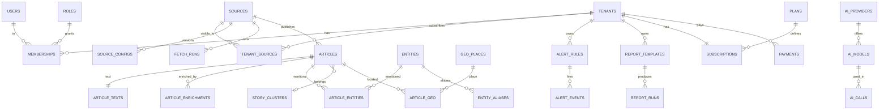

# МедиаРадар — модель данных

> Часть комплекта документов: [PLAN](PLAN.md) · [ARCHITECTURE](ARCHITECTURE.md) · [PRODUCT_SPEC](PRODUCT_SPEC.md) · **DATA_MODEL**
>
> Это **логическая** модель: набор сущностей, ключевые поля и правила. Точные DDL-миграции пишутся в Фазе 0 и далее по фазам.

---

## 1. Соглашения

| Тема | Правило |
|------|---------|
| Идентификаторы | UUIDv7 (упорядочены по времени → хорошая локальность индексов) |
| Время | `timestamptz` в UTC; отображение — в часовом поясе тенанта (`Asia/Barnaul` для Алтайского края) |
| Деньги | Целое в минимальных единицах (копейки) + код валюты |
| Перечисления | `text` + `CHECK` (проще мигрировать, чем enum-типы Postgres) |
| Гибкие структуры | `jsonb`, схема проверяется на уровне приложения (Zod); критичные инварианты — `CHECK` |
| Мультитенантность | Таблицы слоя тенанта содержат `tenant_id`, включён **RLS**; общий слой — без `tenant_id`, доступ через `tenant_sources` |
| Удаление | Данные тенанта — мягкое удаление (`deleted_at`) там, где нужен откат; материалы — по `retention.*` |
| Аудит | `created_at`, `updated_at`, где уместно — `created_by`, `updated_by` |
| Ячейки | У корневых сущностей (`tenants`, `users`) есть `cell_id` (по умолчанию `ru-1`) |
| Секреты | Хранятся зашифрованными (`*_enc`, AES-256-GCM); мастер-ключ — вне БД |
| Миграции | Expand/contract: добавляем → переключаем код → удаляем старое |

---

## 2. Схема связей (ядро)



---

## 3. Сущности по областям

### 3.1 Платформа, тенанты, доступ

| Таблица | Назначение | Ключевые поля |
|---------|------------|---------------|
| `tenants` | Клиент/регион | `id, slug, name, cell_id, status, region_profile jsonb` (страна, регион, часовой пояс, языки, ядро-территория), `legal_profile`, `branding jsonb`, `plan_id` |
| `tenant_domains` | Домены white-label | `tenant_id, domain, verified_at` |
| `users` | Пользователь | `id, email (уникальный, нормализованный), password_hash (argon2id), totp_secret_enc, locale, status, last_login_at` |
| `sessions` | Сессии | `id, user_id, tenant_id, token_hash, ip, user_agent, expires_at, revoked_at` |
| `memberships` | Участие в тенанте | `tenant_id, user_id, role_id, scope jsonb` (ограничения: темы/территории/группы источников), `status` |
| `roles` | Роли | `id, tenant_id (NULL = системная), key, name, is_system` |
| `role_permissions` | Права роли | `role_id, permission` |
| `invitations` | Приглашения | `tenant_id, email, role_id, token_hash, expires_at, accepted_at` |
| `api_keys` | Ключи API | `id, tenant_id, name, key_hash, scopes[], rate_limit, last_used_at, expires_at, revoked_at` |
| `audit_log` | Журнал аудита (append-only, **партиции по месяцам**) | `id, ts, tenant_id, actor_id, actor_type, action, object_type, object_id, before jsonb, after jsonb, ip, user_agent` |

### 3.2 Настройки и флаги

| Таблица | Назначение | Ключевые поля |
|---------|------------|---------------|
| `settings` | Значения реестра настроек | `key, scope_type (platform/tenant/source/user), scope_id, value jsonb, version, updated_by, updated_at` · уникально `(key, scope_type, scope_id)` |
| `settings_history` | История изменений (для отката) | `key, scope_type, scope_id, old_value, new_value, changed_by, reason, ts` |
| `feature_flags` | Флаги функций | `key, enabled, rules jsonb` (по тенантам/тарифам/процентам) |

Определения ключей (тип, схема, области, права, «секрет») живут в коде (`packages/settings`) и версионируются вместе с приложением.

### 3.3 Источники и сбор (общий слой)

| Таблица | Назначение | Ключевые поля |
|---------|------------|---------------|
| `sources` | Реестр источников | `id, owner_tenant_id (NULL = общий), kind, name, url, domain, geo_id, topic_hints[], content_policy, trust_score, language, status (active/paused/error/needs_attention), health jsonb, discovered_from` |
| `source_configs` | Версии конфигов парсера | `source_id, version, config jsonb, author_id, note, is_active, created_at` |
| `source_groups` / `source_group_members` | Группы (для ограничений доступа и подписок) | `id, name` / `group_id, source_id` |
| `tenant_sources` | Подписки тенанта на источники | `tenant_id, source_id, enabled, overrides jsonb (политика контента, расписание), added_by` |
| `crawl_state` | Состояние обхода | `source_id, cursor jsonb, etag, last_modified, next_run_at, interval_sec, consecutive_failures` |
| `fetch_runs` | Журнал прогонов (**партиции по месяцам**) | `id, source_id, kind (live/backfill/manual), started_at, finished_at, status, found, new, updated, duplicates, error, stats jsonb` |
| `backfill_jobs` | Ретро-сбор | `id, source_id, date_from, date_to, cursor jsonb, status, progress, est_total` |
| `raw_documents` | Сырые документы в S3 | `id, source_id, url, fetched_at, http_status, s3_key, content_hash, size, expires_at` |
| `proxy_pools` | Прокси-пулы | `id, name, kind, endpoints_enc, status` |
| `tg_sessions` | Сессии MTProto | `id, label, session_enc, status, flood_wait_until` |

### 3.4 Материалы (общий слой)

Разделение «горячей» и «тяжёлой» части — чтобы лента и аналитика не таскали тексты.

| Таблица | Назначение | Ключевые поля |
|---------|------------|---------------|
| `articles` (**партиции по `published_at`, помесячно** — _в Фазе 0 таблица обычная, партиционирование вводится миграцией в Фазе 1 до появления реальных объёмов_) | Метаданные материала | `id, source_id, url, canonical_url, title, lead, published_at, fetched_at, language, author, image_key, content_hash, simhash, duplicate_of, story_id, visibility_tenant_id (NULL = общий), status, engagement jsonb` |
| `article_texts` | Тело | `article_id, body_text, body_html_sanitized` (хранение/выдача — по `content_policy`) |
| `article_versions` | Правки материала на сайте-источнике | `article_id, version, changed_at, diff_ref` |
| `article_media` | Медиа | `article_id, kind, s3_key, source_url, meta jsonb` |
| `article_enrichments` | Результаты стадий конвейера | `article_id, stage, model_ref, prompt_version, result jsonb, confidence, created_at` · уникально по `(article_id, stage)` для актуальной версии; история — отдельной партицией |
| `article_facts` | **Узкая денормализованная таблица для фильтров и аналитики** | `article_id, published_at, source_id, sentiment_label, sentiment_score, topic_ids[], geo_ids[], entity_ids[], is_original, trust_score` |
| `article_search` | Поисковый индекс | `article_id, tsv tsvector` (title/lead/body с весами) |
| `article_embeddings` | Векторы | `article_id, model_ref, embedding halfvec(1024)` |
| `story_clusters` | Сюжеты | `id, title, first_article_id, first_published_at, size, centroid halfvec, status, summary` |

**Индексы (основные):**
- **Оценка объёма (замер Фазы 0):** запись материала без полного текста занимает ≈ **5 КБ** вместе с индексами (≈ 2,2 КБ таблица + ≈ 2,7 КБ индексы, в т.ч. полнотекстовый). Формула: `объём ≈ число_источников × публикаций_в_день_на_источник × дни × 5 КБ`. Ориентиры при 20 источниках по 30 публикаций в день (600/сут): неделя ≈ 20 МБ, месяц ≈ 90 МБ, год ≈ 1,1 ГБ; при 100 источниках по 100 в день: год ≈ 18 ГБ. Дорого стоят не заголовки, а то, что мы решили не хранить по умолчанию: полный текст (+3–10 КБ на запись), сырой HTML, картинки и, позже, эмбеддинги (≈ 4 КБ на запись). Реальные «публикаций в день» уточняются по первой неделе сбора.
- `articles (source_id, published_at DESC)`; `articles (published_at DESC)` (в каждой партиции); `articles (canonical_url)` уникально в пределах источника; `articles (content_hash)`.
- Поиск ближайших дубликатов по SimHash: 64-битный хэш делится на 4 полосы по 16 бит, по каждой — индекс (banding/LSH); кандидаты уточняются расстоянием Хэмминга.
- _Реализовано в Фазе 0:_ `articles.tsv` — генерируемый столбец (`russian`, заголовок A / лид B) с GIN, отдельный индекс `search_simple` для поиска по префиксу (стеммер Snowball не склоняет, напр., «Барнаул»/«барнаульский»), `pg_trgm` по заголовку. Отдельной таблицы `article_search` пока нет.
- `article_search` — GIN по `tsv`; `articles.title` — GIN `pg_trgm` для подсказок/опечаток.
- `article_facts` — GIN по массивам `topic_ids`, `geo_ids`, `entity_ids`; B-tree по `(sentiment_label, published_at)`.
- `article_embeddings` — HNSW (косинусное расстояние).

### 3.5 Сущности, территории, темы

| Таблица | Назначение | Ключевые поля |
|---------|------------|---------------|
| `entities` | Канонические персоны/организации/места/события | `id, type, canonical_name, description, attributes jsonb (должность, ИНН/ОГРН для организаций…), is_public_figure, status, merged_into` |
| `entity_aliases` | Алиасы и варианты написания | `entity_id, alias, normalized, source (auto/manual)` |
| `article_entities` (**партиции**) | Упоминания | `article_id, entity_id, mentions, salience, sentiment_score, spans jsonb` |
| `entity_relations` | Связи (вычисляемые) | `entity_a, entity_b, kind (co_mention/role/affiliation), weight, period` |
| `geo_places` | Иерархия территорий | `id, parent_id, level (country/region/city/district/settlement), name, oktmo, gar_id, osm_id, lat, lon, geometry_ref, population` |
| `article_geo` | Территории материала | `article_id, geo_id, confidence` |
| `taxonomies` / `topics` | Таксономии и темы (иерархия) | `taxonomies(id, tenant_id NULL, name)` · `topics(id, taxonomy_id, parent_id, key, name, color, keywords[], embedding)` |
| `tenant_article_labels` | Метки и модерация на уровне тенанта | `tenant_id, article_id, topic_ids[], moderation_status, moderated_by, edited_summary, notes` |

### 3.6 Показатели (индикаторы)

| Таблица | Назначение | Ключевые поля |
|---------|------------|---------------|
| `indicator_series` | Ряд | `id, source_id, key, name, unit, frequency, geo_id, topic_id, meta jsonb` |
| `indicator_points` | Точки | `series_id, period_start, value, published_at, revision` |

### 3.7 Алерты, уведомления, фильтры

| Таблица | Назначение | Ключевые поля |
|---------|------------|---------------|
| `saved_filters` | Сохранённые фильтры | `tenant_id, user_id, name, filter jsonb (DSL), visibility (private/team), live_subscribe` |
| `alert_rules` | Правила | `tenant_id, name, level, condition jsonb, channels[], schedule jsonb, dedupe_window_min, enabled, created_by` |
| `alert_events` | Срабатывания | `id, rule_id, fired_at, summary, article_ids[], payload jsonb` |
| `notification_channels` | Каналы доставки | `tenant_id, user_id, type (telegram/email/push/sms), address_enc, verified_at` |
| `deliveries` | Доставки | `event_id, channel_id, status, attempts, sent_at, error` |
| `outbox` | Транзакционный outbox для реалтайма/интеграций | `id, topic, payload jsonb, created_at, published_at` |

### 3.8 Аналитика

| Таблица | Назначение | Ключевые поля |
|---------|------------|---------------|
| `fact_article_hourly` / `fact_article_daily` | Агрегаты | `bucket, source_id, topic_id, geo_id, sentiment_label, count, originals, avg_trust` |
| `fact_entity_daily` | Агрегаты по сущностям | `bucket, entity_id, mentions, avg_sentiment, sources_count` |
| `dashboards` | Дашборды | `tenant_id, owner_id, name, layout jsonb (виджеты), visibility, share_token_hash, share_expires_at` |

### 3.9 Отчёты

| Таблица | Назначение | Ключевые поля |
|---------|------------|---------------|
| `report_templates` | Шаблоны (системные и тенанта) | `id, tenant_id (NULL = системный), name, blocks jsonb, branding_ref, version` |
| `report_runs` | Запуски | `id, template_id, tenant_id, params jsonb, status, started_at, finished_at, error` |
| `report_artifacts` | Файлы | `run_id, format (pdf/xlsx/pptx/csv/html), s3_key, size` |
| `report_schedules` | Расписания | `template_id, cron, timezone, recipients jsonb, params jsonb, enabled` |
| `share_links` | Публичные ссылки | `token_hash, target_type, target_id, expires_at, created_by` |

### 3.10 AI Gateway

| Таблица | Назначение | Ключевые поля |
|---------|------------|---------------|
| `ai_providers` | Провайдеры | `id, type (openai_compat/gigachat/yandex/anthropic/gemini/ollama/custom_http), name, base_url, auth_enc jsonb, jurisdiction (ru/foreign/local), tls jsonb, proxy_ref, status` |
| `ai_models` | Модели | `id, provider_id, model_key, capabilities jsonb (chat/embed/json/tools/stream), context_tokens, price_in_per_1m, price_out_per_1m, languages[], status, health jsonb` |
| `ai_routes` | Маршруты задач | `id, task, tenant_id (NULL = платформа), chain jsonb (упорядоченный список моделей + условия), mode (active/shadow/ab), priority` |
| `ai_prompts` | Промпты | `key, version, template, output_schema jsonb, status, author_id, note` |
| `ai_calls` (**партиции по месяцам**) | Журнал вызовов | `id, ts, tenant_id, task, model_id, prompt_version, tokens_in, tokens_out, cost, latency_ms, status, cache_hit` |
| `ai_budgets` | Бюджеты | `scope_type, scope_id, task, period, limit_tokens, limit_money, hard_stop` |
| `ai_eval_sets` / `ai_eval_runs` | Эталонные выборки и прогоны оценки | `set(id, task, items_ref)` · `run(id, set_id, model_id, prompt_version, metrics jsonb)` |

### 3.11 Биллинг

| Таблица | Назначение | Ключевые поля |
|---------|------------|---------------|
| `plans` | Тарифы | `id, key, name, price_minor, currency, interval, is_public, active` |
| `plan_entitlements` | Лимиты и флаги тарифа | `plan_id, key, value jsonb` |
| `subscriptions` | Подписки | `tenant_id, plan_id, status, period_start, period_end, trial_end, cancel_at, payment_method_id, grace_until` |
| `usage_events` (**партиции**) → `usage_daily` | Учёт расхода (источники, доставленные материалы, AI-токены, экспорты, API-запросы) | `tenant_id, meter, qty, ts, ref` → агрегат по дням |
| `payments` | Платежи | `id, tenant_id, provider, provider_payment_id, amount_minor, currency, status, purpose, receipt jsonb, idempotence_key, created_at, paid_at` |
| `refunds` | Возвраты | `id, payment_id, provider_refund_id, amount_minor, status, reason` |
| `payment_methods` | Сохранённые способы | `id, tenant_id, provider, token_enc, brand, last4, expires_at` |
| `invoices` | Счета (в т.ч. юрлицам) | `id, tenant_id, number, amount_minor, status, payer jsonb, pdf_key, issued_at, paid_at` |
| `provider_events` | Журнал событий провайдеров (идемпотентность) | `provider, event_id (уникально), payload jsonb, received_at, processed_at, error` |
| `promo_codes` | Промокоды | `code, kind, value, valid_from, valid_to, max_uses, used` |

### 3.12 Дискавери

| Таблица | Назначение | Ключевые поля |
|---------|------------|---------------|
| `discovery_jobs` | Задания на поиск источников | `id, tenant_id, spec jsonb (регион, уровни, отрасли, лимиты), status, progress, stats jsonb` |
| `discovery_candidates` | Кандидаты | `id, job_id, url, domain, kind, evidence jsonb (скриншот, превью, проверки), scores jsonb (авторитетность, парсимость, темп), classification jsonb, status (pending/approved/rejected/postponed), source_id (после утверждения), decided_by, decided_at` |

---

## 4. Изоляция тенантов (RLS) — паттерн

```sql
-- Слой тенанта: строго по tenant_id
ALTER TABLE alert_rules ENABLE ROW LEVEL SECURITY;
ALTER TABLE alert_rules FORCE ROW LEVEL SECURITY;
CREATE POLICY tenant_isolation ON alert_rules
  USING      (tenant_id = current_setting('app.tenant_id', true)::uuid)
  WITH CHECK (tenant_id = current_setting('app.tenant_id', true)::uuid);

-- Общий слой: материал виден, если источник подключён к тенанту, либо материал приватный для него
CREATE POLICY articles_read ON articles FOR SELECT TO app_api USING (
     (visibility_tenant_id IS NULL AND source_id IN (
        SELECT source_id FROM tenant_sources
        WHERE tenant_id = current_setting('app.tenant_id', true)::uuid AND enabled))
  OR  visibility_tenant_id = current_setting('app.tenant_id', true)::uuid
);
```

API в начале транзакции выполняет `SET LOCAL app.tenant_id = '<uuid>'`. Роль `app_worker` имеет отдельные политики (доступ к общему слою и явные операции над слоем тенанта). CI проверяет по `pg_catalog`, что у каждой таблицы с `tenant_id` включён RLS и есть политика, а автотесты пробуют кросс-тенантное чтение/запись/удаление.

---

## 5. Хранение и сроки (значения по умолчанию, настраиваются)

| Данные | Срок | Ключ настройки |
|--------|------|----------------|
| Сырой HTML/JSON в S3 | 90 дней | `retention.rawHtmlDays` |
| Нормализованные материалы и обогащение | бессрочно | `retention.articleDays` |
| Журнал вызовов AI | 30 дней | `retention.aiCallLogDays` |
| Журнал прогонов парсеров | 180 дней (агрегаты — бессрочно) | `retention.fetchRunDays` |
| Журнал аудита | 3 года | `retention.auditDays` |
| Изображения | Оригинал не храним; главная + миниатюры, по сроку материала | `retention.imageDays` |
| Сообщения чатов (политика `metadata`) | Короткий срок; авторы псевдонимизированы | `retention.chatMessageDays` |
| Отчёты (файлы) | 12 месяцев | `retention.reportDays` |
| Персональные данные пользователей | До удаления аккаунта + срок по закону | профиль `legal.profile` |

Старые партиции отсоединяются и архивируются (в S3) или удаляются по политике; процедура — часть ранбука.
